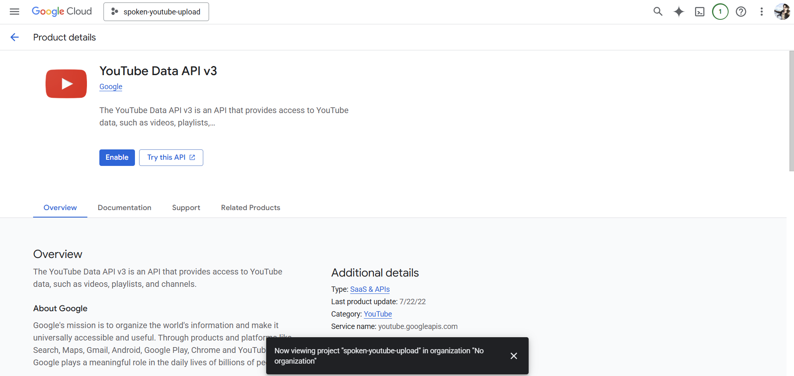
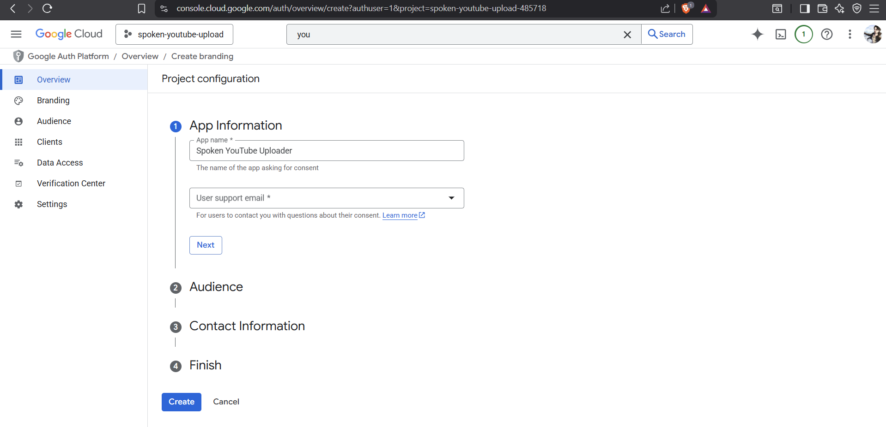
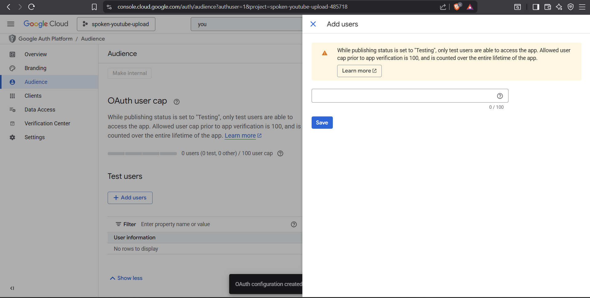
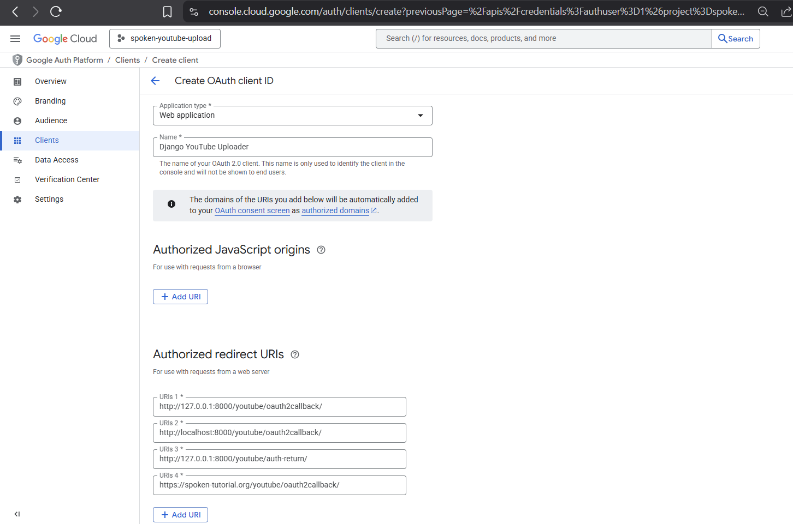

# YouTube OAuth Setup Guide  
*Spoken Tutorial – YouTube Upload Integration*

This document explains how to create and configure Google OAuth credentials required for uploading videos to YouTube from the Spoken Tutorial website.

The YouTube Data API does **not** allow uploads using a simple API key. Uploading requires OAuth 2.0 credentials because it modifies a user's YouTube channel.

---

## 1. Create a Google Cloud Project

1. Visit: https://console.cloud.google.com/
2. Click **New Project**
3. Name it something like:

```
spoken-youtube-upload
```

4. Create the project.


---

## 2. Enable YouTube Data API v3

1. Inside the project, go to **APIs & Services → Library**
2. Search for **YouTube Data API v3**
3. Click **Enable**



---

## 3. Configure OAuth Consent Screen

1. Go to **APIs & Services → OAuth consent screen → Get Started**
2. Fill the basic details:
   - App name: `Spoken YouTube Uploader`
   - User support email: your email
3. Choose **External**
4. Save and continue with defaults.




If the app is in **Testing** mode, go to **Audience** and add your email under **Test Users**.




---

## 4. Create OAuth Client ID

1. Go to **APIs & Services → Credentials**
2. Click **Create Credentials → OAuth client ID**
3. Application type: **Web application**
4. Name: `Django YouTube Uploader`
5. Add the following **Authorized redirect URIs**:

```
http://127.0.0.1:8000/youtube/oauth2callback/
http://localhost:8000/youtube/oauth2callback/
https://spoken-tutorial.org/youtube/oauth2callback/
```

6. Save.



---

## 5. Download Client Secret

1. In the Credentials list, click the download icon for the OAuth client.
2. Rename the file to:

```
client_secret.json
```

3. Place it in:

```
spoken-website/youtube/client_secret.json
```

This file is required for authentication and **must not be committed to version control**.


---

## 6. First-Time Authorization

1. Open the upload page:

```
/software-training/add-youtube-video/
```

2. If not authorized, the page will show:

> "YouTube credentials not found. Click here to authorize."

3. Click the link and sign in with the Google account that owns the YouTube channel.
4. Grant access.
5. You will be redirected back to the site.

This is a one-time step. After authorization, uploads work normally.

---

## Notes

- Each environment (local, staging, production) must have its redirect URI registered.
- Only users added as **Test Users** can authorize while the app is unverified.
- Upload permissions inside the site are controlled by:

```python
# spoken/config.py
YOUTUBE_UPLOAD_ROLES = ["YouTube Admin"]
```

Only users in these roles can access the upload feature.

---
